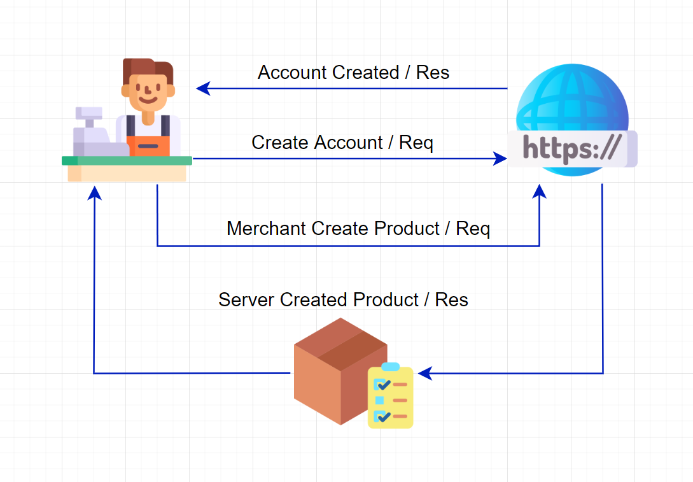

# :zap: Backend Mini Project (Server Development)

This is my dibimbing's React.js and Express mini project. I have been learning 4 sub chapters of the lesson by Ka Romi Ario Utomo, my dibimbing's mentor. And here it is, my first ever back-end project. E

## Architectural Diagram
Here is the Architectural Diagram of the project \

## Entity Relational Diagram
Here is the ERD of the project \
 

# API Contract
