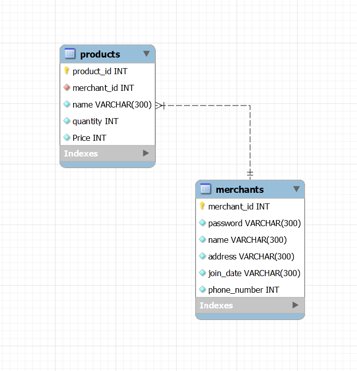

# Backend Mini Project (Server Development)

This is my dibimbing's React.js and Express mini project. I have been learning 4 sub chapters of the lesson by Ka Romi Ario Utomo, my dibimbing's mentor. And here it is, my first ever back-end project. 

## :hotdog: Architectural Diagram
Here is the Architectural Diagram of the project \

## :rice_ball: Entity Relational Diagram
Here is the ERD of the project \
 

## :tea: API Contract
## Merchants
Merchant object \
{ \
  merchant_id: integer \
  password: string \
  name: string \
  address: string \
  join_date: string \
  phone_number: integer \
} \

#### POST /merchants
Creates a new Merchant and returns the new object. \
URL Params \
None \
Headers \
Content-Type: application/json \
Data Params \
  { \
    merchant_id: integer, \
    password: string, \
    name: string, \
    address: string, \
    join_date: string, \
    phone_number: integer, \
  } \
Error Response: \
Code: 400 \
Content: { message: 'Invalid merchant id } \
Success Response: \
Code: 201 \
Content: { message: 'Success create new merchant data!' } \

#### DELETE /merchants/:merchant_id 
Deletes the specified user. \
URL Params \
Required: id=[integer] \
Data Params \
None \
Headers \
Content-Type: application/json \
Error Response: \
Content: { err } \
Success Response: \
Code: 200 \
Content: { message: 'Success delete merchant data!' } \

#### POST /merchants/login
Creates a new Merchant and returns the new object. \
URL Params \
None \
Headers \
Content-Type: application/json \
Authorization: Bearer <OAuth Token> \
Data Params \
  { \
    password: string, \
    name: string \
  } \
Success Response: \
Code: 200 \
Content: { token } \
Error Response: \
Code: 401 \
Content: { message: 'Unauthorized' } \

## Products
Product object \
{ \
  product_id: integer \
  name: string \
  quantity: integer \
  Price: integer \
} \

#### POST /products
Creates a new Product and returns the new object. \
URL Params \
None \
Data Params \
  { \
    product_id: integer, \
    name: string, \
    quantity: integer, \
    Price: integer \
  } \
Headers \
Content-Type: application/json \
Error Response: \
Code: 400 \
Content: { message: 'Invalid name' } \
Success Response: \
Code: 201 \
Content: { message: 'Success create new product data!' } \

#### DELETE /products/:product_id
Deletes the specified product. \
URL Params \
Required: id=[integer] \
Data Params \
None \
Headers \
Content-Type: application/json \
Error Response: \
Content: { err } \
Success Response: \
Code: 200 \
Content: { message: 'Success delete product data!' } \

#### PUT /products/:product_id
Updates fields on the specified product and returns the updated object. \
URL Params \
Data Params \
  { \
  	product_id: integer, \
    name: string, \
    quantity: integer, \
    Price: integer \
  } \
Headers \
Content-Type: application/json \
Error Response: \
Content: { err } \
Success Response: \
Code: 200 \
Content: { message: 'Success update product data!' } \ 

#### GET /products
Returns all products in the system. \
URL Params \
None \
Data Params \
None \
Headers \
Content-Type: application/json \
Content: \
{ \
  product_id: integer, \
  name: string, \
  quantity: integer, \
  Price: integer \
}
